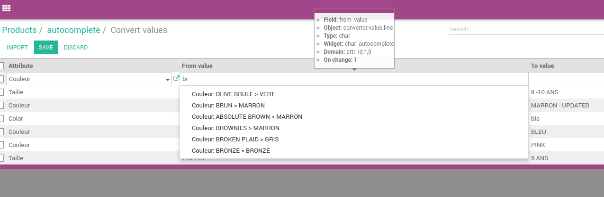

.. image:: https://img.shields.io/badge/licence-AGPL--3-blue.svg
   :target: http://www.gnu.org/licenses/agpl-3.0-standalone.html
   :alt: License: AGPL-3

==============================
Char Field autocomplete widget
==============================

Add autocomplete widget for char fields.


Usage and configuration
=======================

On your char field you can declare the widget `char_autocomplete`:

```
<field name="char_field" widget="char_autocomplete" options='{"model":"res.partner"}' />
```

The only required option is `model`: it will be used to fetch results for the autocomplete.

Additional options
------------------

* `search_field`: the domain will use this field to search. Default: `name`.

  For instance, if you type "camp" the domain will be `[('name', 'ilike', '%camp%')]`

* `value_field`: the field that provide the real value for the char field. Default: `name`.
* `display_field`: the field used for autocomplete search results label. Default: `name`.
* `fields`: fields to be loaded on `search_read`. Default: `[display_field, value_field]`.

Domains
-------

If you set a domain on you char field (maybe via onchange) the widget will take care of it.

In this example you can see that the domain has been set by the field `attr_id`
hence the results are filtered with this parameter too.

|preview|

Bug Tracker
===========

Bugs are tracked on `GitHub Issues
<https://github.com/OCA/web/issues>`_. In case of trouble, please
check there if your issue has already been reported. If you spotted it first,
help us smashing it by providing a detailed and welcomed feedback.

Credits
=======

Images
------

* Odoo Community Association: `Icon <https://github.com/OCA/maintainer-tools/blob/master/template/module/static/description/icon.svg>`_.

Contributors
------------

* Simone Orsi <simone.orsi@camptocamp.com>

Maintainer
----------

.. image:: https://odoo-community.org/logo.png
   :alt: Odoo Community Association
   :target: https://odoo-community.org

This module is maintained by the OCA.

OCA, or the Odoo Community Association, is a nonprofit organization whose
mission is to support the collaborative development of Odoo features and
promote its widespread use.

To contribute to this module, please visit https://odoo-community.org.



